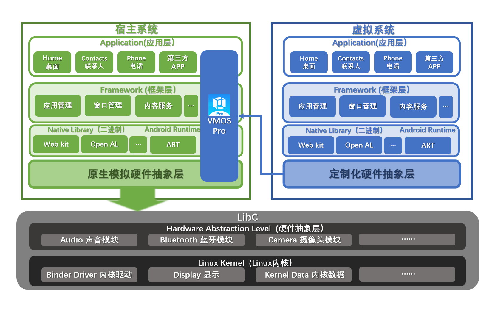

# VMOS Pro Android 5.1 ROM 介绍
#### 一、项目简介
* 此项目是用于配合 VMOS Pro 使用的虚拟机源码，基于 Android 源码 aosp-5.1.1_r38 版本打造，支持高于 Android 5.1的设备使用。
* VMOS Pro 应用下载地址：https://www.vmos.com
* 源码大小50Gb左右，编译输出后的项目整体大小在100Gb左右，请提前准备好所需的磁盘空间

#### 二、用途简介
VMOS Pro Android 5.1 ROM 可理解为通过 VMOS Pro 运行在 Android 系统内的虚拟机，通过对其开源代码的编译可以实现定制 ROM，在 VMOS Pro 中运行由你打造的“个性化虚拟机”。  
目前此技术广泛应用于应用多开、数据隔离、移动办公安全、手机模拟信息等领域。

# VMOS Pro Android 5.1 ROM 技术架构

公司的核心技术 VMOS Pro 虚拟操作系统是以普通 APP 权限运行在 Android 系统上的 Android 虚拟系统，图示左上部分为真实 Android 系统，包含了应用层，Framework 层，HAL 抽象层和安卓操作内核。
通过将 VMOS Pro 虚拟操作系统运行在真实 Android 系统的应用层,它会创建并启动一个基于 AOSP 修改的 Android 虚拟操作系统，具体生成的虚拟操作系统参见图示右上部分。
右上部分的 VMOS Pro 虚拟操作系统包含了独立的应用层，Framework 层，HAL 抽象层，在虚拟系统里运行的应用与真实 Android 系统运行的应用相互隔离，VMOS Pro 虚拟操作系统的应用层，Framework 层，HAL 抽象层可受小算科技开发人员和使用者自主控制修改。VMOS Pro 虚拟操作系统为 HAL 抽象层做了虚拟化，可使用真实 Android 系统的硬件设备数据，或填充虚拟数据。


# VMOS Pro Android 5.1 ROM 构建与部署
#### 构建
* 拉取代码：```git clone --recurse-submodules https://github.com/VMOS-XiaoSuan/open-vmos-aosp_5.1.git```
* 编译环境：建议使用Docker编译，避免无意义的编译环境调试。[使用Docker编译Android源代码](./Compile%20AOSP%20with%20Docker.md)  
* 在源码根目录下执行编译脚本```make_arm64_user.sh```(64位) 或者 ```make_arm_user.sh```(32位)  

#### 部署
1. 维护系统版本号：手动更改源码根目录下```rom_version_arm64```(64位) 或者 ```rom_version_arm```(32位) 中的版本号。（只是为了做版本管理，不修改也可以）  
2. 在源码根目录下执行打包脚本```pack_arm64_user.sh```(64位) 或者 ```pack_arm_user.sh```(32位) 
3. 脚本执行成功后，系统镜像包会输出在```$ANDROID_BUILD_TOP/vmos_51_$TARGET_PRODUCT-$TARGET_BUILD_VARIANT.zip```中
4. 打包成功后的 zip 包可以导入到 VMOS Pro(2.9.3版本及以上) 中使用

# VMOS Pro Android 5.1 ROM 使用场景
#### 1、实现应用多开
通过在 VMOS Pro 中添加多个 Android 5.1 ROM，可以实现在一部手机上同时安装多个 QQ 等应用或游戏，并登录多个账号。

#### 2、满足移动安全需求
VMOS Pro Android 5.1 ROM 提供了一整套内部与外部的隔离机制，也就是说其内部是一个“完全独立于系统的空间”。这样一来在日常生活和工作都离不开的手机上，既可以实现数据隔离的安全需求，也能满足个人生活和工作场景的隔离。  
通过公布的开源代码，只需稍作定制即可实现应用行为审计、数据加密、数据采集、数据防泄漏、防攻击泄密等移动安全相关的需求。

#### 3、满足免 ROOT HOOK 需求，实现对内部 App 的完全控制
VMOS Pro Android 5.1 ROM 提供了 Java 与 Native 的 Hook 能力，在其中可以实现虚拟定位、App 监控管理、移动安全等各种场景功能。

#### 4、支持 Google 服务
实现了对 Google 服务的支持，以支持 Twitter、Instagram、FaceBook、Youtube等海外 App 运行。

# VMOS Pro Android 5.1 ROM 兼容稳定性
本虚拟机源码是配合 VMOS Pro 使用，已经在国内外海量常见机型设备中广泛应用。  
而截止目前，VMOS Pro Android 5.1 ROM 支持的安卓系统：  
高于 Android 5.1 的设备。  
  
支持的 APP 类型：  
包括32位和64位。  
  
支持的 HOOK 类型：
包括 Java Hook 和 Native Hook。  
  
支持的 CPU 类型：  
包括 ARM 32 和 ARM 64。  

# 授权说明
VMOS Pro Android 5.1 ROM 技术归属于：湖南小算科技信息有限公司，已申请多项VMOS Pro Android 5.1 ROM 知识产权，受中华人民共和国知识产权法保护。
个人可使用 Github 上 VMOS Pro Android 5.1 ROM 的代码，下载源代码进行参考学习、修改和个性化定制，编译打包后可导入 VMOS Pro 使用。
但不可用于商用，如有商用需要，可联系购买。VMOS Pro Android 5.1 ROM 在 VMOS Pro 内启动次数超过六百万次，购买商业授权后，您将享受到不断迭代更新的技术成果。

# 特此声明
您如果未经授权将 VMOS Pro Android 5.1 ROM 用于内部使用、商业牟利或上传应用市场，我们将取证后报警（侵犯著作权罪）或起诉。
凡举报未经授权或违法使用 VMOS Pro Android 5.1 ROM 代码开发产品的，一经核实给予奖励。我们会对举报人身份保密！
