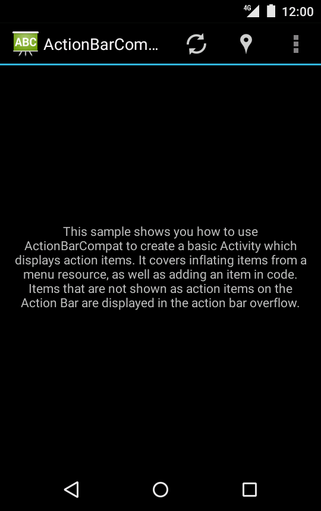

Android ActionBarCompat-Basic Sample
===================================

This sample shows you how to use ActionBarCompat to create a basic Activity
which displays action items. It covers inflating items from a menu resource,
as well as adding an item in code.

Introduction
------------

Android 3.0 introduced the “action bar” control, a toolbar that is expected
to be present in most types of applications. This control identifies the user
location, and provides user actions and navigation modes.
Using the action bar offers your users a familiar interface across applications
that the system gracefully adapts for different screen configurations.

Instantiating an action bar can be done by using the [ActionBar][1] API provided
in API 11 or above. Support for older devices is provided by the
[support library’s ActionBar][2] implementation, compatible back to API 7.
This sample demonstrates using the support library APIs.

Using an ActionBar with the support library requires the following steps:

1. Create your activity by extending ActionBarActivity.
2. Use (or extend) one of the Theme.AppCompat themes for your activity.

Once this is done, action items will be created for any options menu items that
would otherwise be created during when `[onCreateOptionsMenu()][3]` is called.

[1]: http://developer.android.com/reference/android/app/ActionBar.html
[2]: http://developer.android.com/reference/android/support/v7/app/ActionBar.html
[3]: http://developer.android.com/reference/android/app/Activity.html#onCreateOptionsMenu(android.view.Menu)

Pre-requisites
--------------

- Android SDK v21
- Android Build Tools v21.1.1
- Android Support Repository

Screenshots
-------------

  

Getting Started
---------------

This sample uses the Gradle build system. To build this project, use the
"gradlew build" command or use "Import Project" in Android Studio.

Support
-------

- Google+ Community: https://plus.google.com/communities/105153134372062985968
- Stack Overflow: http://stackoverflow.com/questions/tagged/android

If you've found an error in this sample, please file an issue:
https://github.com/googlesamples/android-ActionBarCompat-Basic

Patches are encouraged, and may be submitted by forking this project and
submitting a pull request through GitHub. Please see CONTRIBUTING.md for more details.

License
-------

Copyright 2014 The Android Open Source Project, Inc.

Licensed to the Apache Software Foundation (ASF) under one or more contributor
license agreements.  See the NOTICE file distributed with this work for
additional information regarding copyright ownership.  The ASF licenses this
file to you under the Apache License, Version 2.0 (the "License"); you may not
use this file except in compliance with the License.  You may obtain a copy of
the License at

http://www.apache.org/licenses/LICENSE-2.0

Unless required by applicable law or agreed to in writing, software
distributed under the License is distributed on an "AS IS" BASIS, WITHOUT
WARRANTIES OR CONDITIONS OF ANY KIND, either express or implied.  See the
License for the specific language governing permissions and limitations under
the License.
