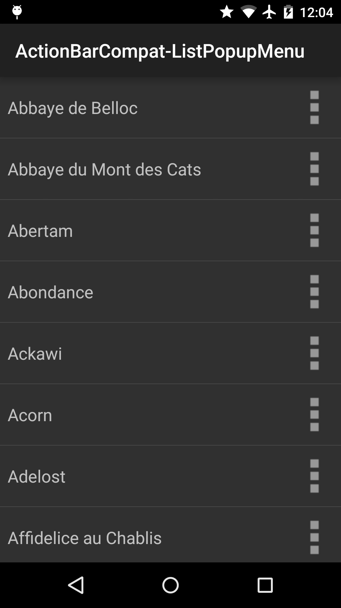
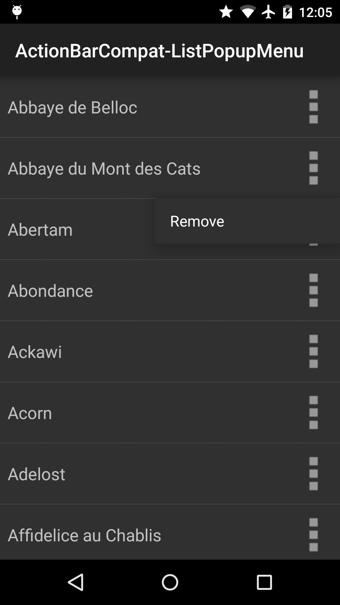

Android ActionBarCompat-ListPopupMenu Sample
===================================

This sample shows how to display a pop up menu using PopupMenu from the v7 appcompat library.

Introduction
------------

This sample displays a list of items and for each item, an icon can be clicked. When it is clicked, a pop up menu is shown, placed below the item, using the [PopupMenu][1] from the v7 appcompat support library.

The sample uses [ListFragment][2] from the v4 support library to display the list. It shows how to instantiate and display the [PopupMenu][1], as well as how to use `setOnMenuItemClickListener(new PopupMenu.OnMenuItemClickListener())` to process the user actions on the [PopupMenu][1].

[1]: https://developer.android.com/reference/android/support/v7/widget/PopupMenu.html
[2]: https://developer.android.com/reference/android/support/v4/app/ListFragment.html

Pre-requisites
--------------

- Android SDK v21
- Android Build Tools v21.1.1
- Android Support Repository

Screenshots
-------------

  

Getting Started
---------------

This sample uses the Gradle build system. To build this project, use the
"gradlew build" command or use "Import Project" in Android Studio.

Support
-------

- Google+ Community: https://plus.google.com/communities/105153134372062985968
- Stack Overflow: http://stackoverflow.com/questions/tagged/android

If you've found an error in this sample, please file an issue:
https://github.com/googlesamples/android-ActionBarCompat-ListPopupMenu

Patches are encouraged, and may be submitted by forking this project and
submitting a pull request through GitHub. Please see CONTRIBUTING.md for more details.

License
-------

Copyright 2014 The Android Open Source Project, Inc.

Licensed to the Apache Software Foundation (ASF) under one or more contributor
license agreements.  See the NOTICE file distributed with this work for
additional information regarding copyright ownership.  The ASF licenses this
file to you under the Apache License, Version 2.0 (the "License"); you may not
use this file except in compliance with the License.  You may obtain a copy of
the License at

http://www.apache.org/licenses/LICENSE-2.0

Unless required by applicable law or agreed to in writing, software
distributed under the License is distributed on an "AS IS" BASIS, WITHOUT
WARRANTIES OR CONDITIONS OF ANY KIND, either express or implied.  See the
License for the specific language governing permissions and limitations under
the License.
