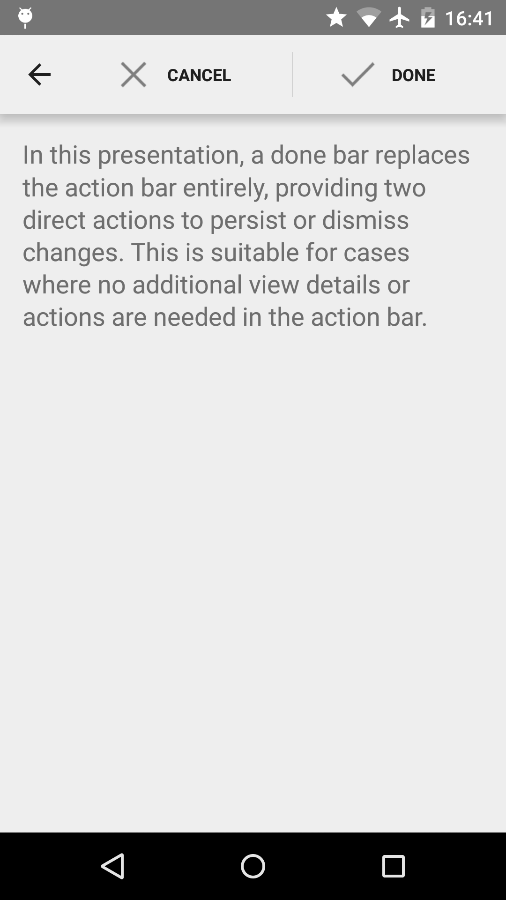

Android DoneBar Sample
===================================

This sample shows how to create a custom view in the ActionBar to show a done button, using
2 alternative layouts. This is well suited for simple data entry activities, where the only
options for the user are to cancel or confirm the data changes.

Introduction
------------

API 11 introduced the [ActionBar][1] as a navigational UI element. In most cases, a custom view isn't required
or even recommended, as using a menu xml file is all that is needed to add action icons to it. However, it is
possible to use a custom view and it is useful in some cases.

This sample contains two activities with custom views in their action bar, each with a "done" button. These are
designed to be used with simple data entry screen where the only options for the user are to cancel or confirm
the changes.

1. Create a layout for the [ActionBar][2].
2. In the activity, before setting the content view, inflate the view using the LayoutInflater.
3. Use `getActionBar()` to get the ActionBar, and set the display options with `ActionBar.DISPLAY_SHOW_CUSTOM`.
4. Set the custom view by calling `setCustomView(customActionBarView, new ActionBar.LayoutParams(
ViewGroup.LayoutParams.MATCH_PARENT,ViewGroup.LayoutParams.MATCH_PARENT))` on the ActionBar.
5. You can now set the content view of the Activity.

[1]: http://developer.android.com/design/patterns/actionbar.html
[2]: http://developer.android.com/reference/android/app/ActionBar.html

Pre-requisites
--------------

- Android SDK v21
- Android Build Tools v21.1.1
- Android Support Repository

Screenshots
-------------

   

Getting Started
---------------

This sample uses the Gradle build system. To build this project, use the
"gradlew build" command or use "Import Project" in Android Studio.

Support
-------

- Google+ Community: https://plus.google.com/communities/105153134372062985968
- Stack Overflow: http://stackoverflow.com/questions/tagged/android

If you've found an error in this sample, please file an issue:
https://github.com/googlesamples/android-DoneBar

Patches are encouraged, and may be submitted by forking this project and
submitting a pull request through GitHub. Please see CONTRIBUTING.md for more details.

License
-------

Copyright 2014 The Android Open Source Project, Inc.

Licensed to the Apache Software Foundation (ASF) under one or more contributor
license agreements.  See the NOTICE file distributed with this work for
additional information regarding copyright ownership.  The ASF licenses this
file to you under the Apache License, Version 2.0 (the "License"); you may not
use this file except in compliance with the License.  You may obtain a copy of
the License at

http://www.apache.org/licenses/LICENSE-2.0

Unless required by applicable law or agreed to in writing, software
distributed under the License is distributed on an "AS IS" BASIS, WITHOUT
WARRANTIES OR CONDITIONS OF ANY KIND, either express or implied.  See the
License for the specific language governing permissions and limitations under
the License.
