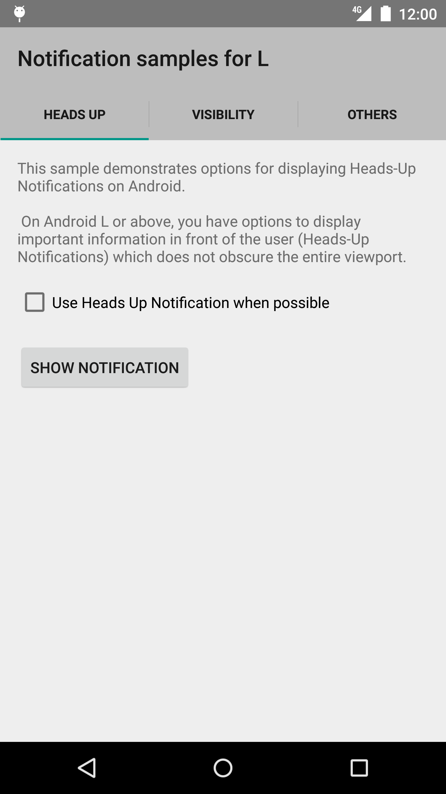
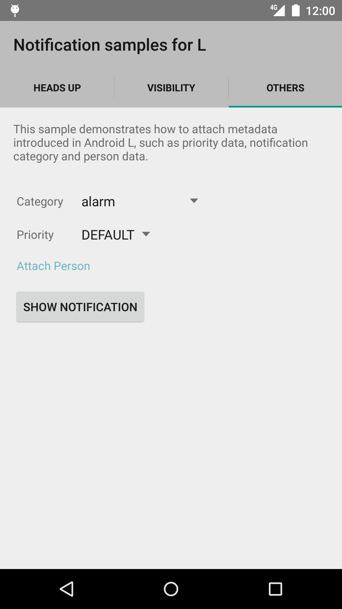

Android LNotifications Sample Sample
===================================

This sample demonstrates new features for notifications introduced in Android L.
These features include heads-up notifications, visibility, people, category and priority
metadata.

Introduction
------------

Android 5.0 (Lollipop, API level 21) introduced additional features to the Notification API.
Specifically, it allows developers to specify the priority and visibility level for
notifications. This metadata allows the system to provide enhanced security for notifications
while the lock screen is active, allows high-priority notifications to appear even when
the notification bar is closed, and provides users to silence low-priority notifications
when they're busy.

This metadata is provided via additional arguments to the `Notification.Builder` class.

Specifically, this sample demonstrates how to generate a heads-up notification
(`HeadsUpNotificationFragment`), how to control visibility on the lock screen
(`VisibilityMetadataFragment`), and how to set the category, priority, and associated contact
for a notification (`OtherMetadataFragment`).

Pre-requisites
--------------

- Android SDK v21
- Android Build Tools v21.1.1
- Android Support Repository

Screenshots
-------------

   

Getting Started
---------------

This sample uses the Gradle build system. To build this project, use the
"gradlew build" command or use "Import Project" in Android Studio.

Support
-------

- Google+ Community: https://plus.google.com/communities/105153134372062985968
- Stack Overflow: http://stackoverflow.com/questions/tagged/android

If you've found an error in this sample, please file an issue:
https://github.com/googlesamples/android-LNotifications Sample

Patches are encouraged, and may be submitted by forking this project and
submitting a pull request through GitHub. Please see CONTRIBUTING.md for more details.

License
-------

Copyright 2014 The Android Open Source Project, Inc.

Licensed to the Apache Software Foundation (ASF) under one or more contributor
license agreements.  See the NOTICE file distributed with this work for
additional information regarding copyright ownership.  The ASF licenses this
file to you under the Apache License, Version 2.0 (the "License"); you may not
use this file except in compliance with the License.  You may obtain a copy of
the License at

http://www.apache.org/licenses/LICENSE-2.0

Unless required by applicable law or agreed to in writing, software
distributed under the License is distributed on an "AS IS" BASIS, WITHOUT
WARRANTIES OR CONDITIONS OF ANY KIND, either express or implied.  See the
License for the specific language governing permissions and limitations under
the License.
